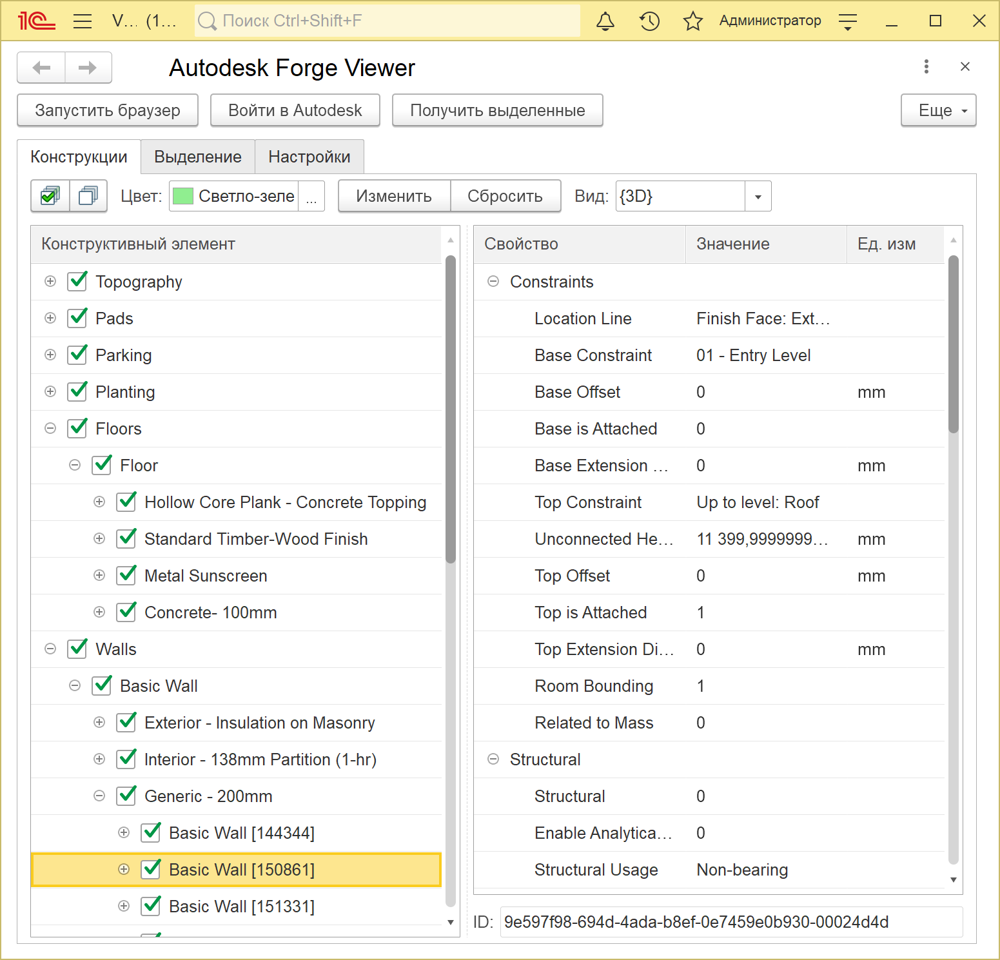
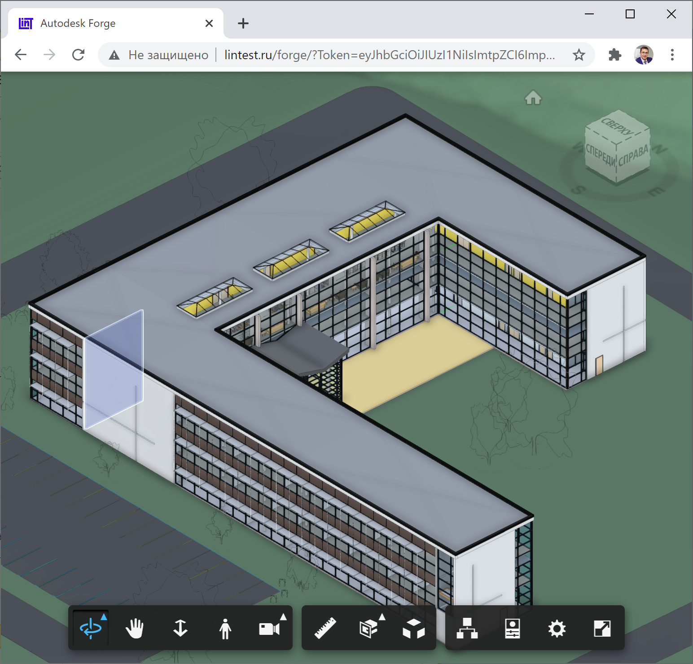

### Пример взаимодействия между 1С и облачным сервисом Autodesk Forge Viewer

Порядок развертывания примера:

1. Публикуем содержимое папки **inetpub** на любом интернет-сайте.

2. Регистрируемся на сайте https://forge.autodesk.com и получаем триальную учётную запись на полгода.

3. Регистрируем свое приложение по инструкции: https://forge.autodesk.com/developer/start-now/getaccess

4. Выгружаем BIM-модель на сайт http://viewer.autodesk.com и получаем идентификатор документа. 

5. Примеры готовых моделей можно скачать по адресу: [Revit Sample Project Files](https://knowledge.autodesk.com/support/revit-products/getting-started/caas/CloudHelp/cloudhelp/2019/ENU/Revit-GetStarted/files/GUID-61EF2F22-3A1F-4317-B925-1E85F138BE88-htm.html)

6. Указываем в параметрах внешней обработки идентификаторы клиента и модели.

